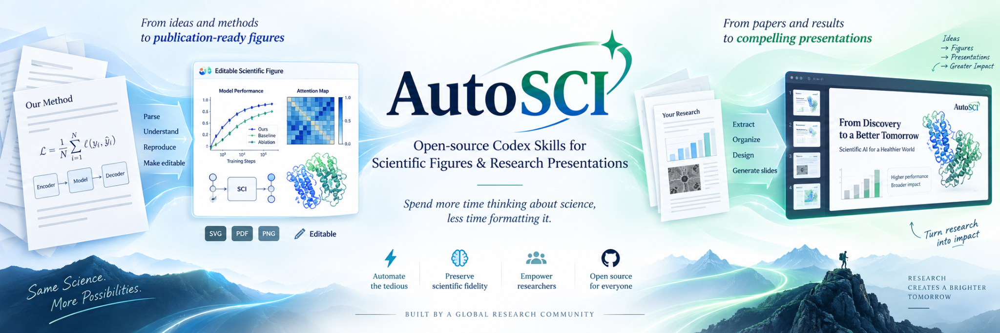

# AutoSCI

<p align="center">
  
</p>

<p align="center"><strong>Spend more time thinking about science, less time formatting it.</strong></p>

<p align="center">
  Open-source, local-first Codex skills for scientific figures, paper reading, group meetings, research updates, and technical presentations.
</p>

<p align="center">
  <a href="README_zh.md">中文</a> ·
  <a href="#quick-start">Quick Start</a> ·
  <a href="#skills">Skills</a> ·
  <a href="#under-the-hood">Under the Hood</a> ·
  <a href="skills/scientific-figure/scripts/">Python Tools</a> ·
  <a href="CONTRIBUTING.md">Contributing</a>
</p>

<p align="center">
  
  
  
  
</p>

## What is AutoSCI?

AutoSCI is **not just a collection of prompts**. It packages research workflows as Codex Skills and backs the parts that should be deterministic with real tooling.

```text
research source / paper / method / results
                    │
                    ↓
             Codex Skill workflow
          (SKILL.md + references)
                    │
          ┌─────────┴─────────┐
          ↓                   ↓
 scientific reasoning   deterministic tooling
 & visual decisions      Python / QA / render
          └─────────┬─────────┘
                    ↓
       scientific artifact
   figure / presentation / QA
```

The design principle is simple: **encode scientific judgment as an inspectable workflow, and automate the mechanical parts with deterministic code.**

## Why AutoSCI?

Research time is expensive. Too much of it is still spent on work that is necessary but repetitive: redrawing method diagrams, aligning arrows, rebuilding figures, cropping paper screenshots, arranging slides, checking legends, and repeatedly fixing presentation layouts.

**AutoSCI exists to reduce that mechanical cost.** We want researchers to spend more attention on the scientific question, the method, the experiment, the interpretation, and the next idea — while reusable Codex skills handle more of the tedious production work around scientific communication.

This is not about replacing scientific judgment. It is about removing friction between an idea and a clear scientific artifact.

> **Automate the tedious. Preserve the science. Leave more room for imagination.**

## Skills

AutoSCI currently contains two complementary, independently installable skills:

| Skill | What it does | Implementation |
| --- | --- | --- |
| [`scientific-figure`](skills/scientific-figure) | Creates/reconstructs editable scientific figures from methods, equations, code, data, or existing figures | Skill workflow + references + **Python orchestration, audits, rendering, release and benchmark tooling** |
| [`academic-research-presentation`](skills/academic-research-presentation) | Builds/reviews evidence-first paper-reading, group-meeting, research-update, and technical-talk workflows | Skill workflow + references + templates + source-visual/diagram QA rules |

They can be used separately or together:

```text
paper / method / results
        │
        ├── need a custom scientific figure?
        │          ↓
        │   $scientific-figure
        │          ↓
        │      editable SVG
        │
        └──────────┬──────────
                   ↓
      $academic-research-presentation
                   ↓
          research presentation
```

## Under the Hood

The repository intentionally combines **agent instructions, domain knowledge, structured templates, and executable code** rather than hiding the workflow behind a black-box service.

### Scientific Figure: executable pipeline

```text
SKILL.md
   ↓
source-grounded figure_spec.json
   ↓
Python orchestration
   ↓
editable SVG master
   ↓
deterministic QA
   ├── source / claim audit
   ├── semantic traceability
   ├── geometry audit
   ├── notation audit
   ├── final-size legibility
   └── portability / release checks
   ↓
render → critique → targeted refinement
   ↓
SVG / PNG / PDF release package
```

Key executable entry points live in [`skills/scientific-figure/scripts/`](skills/scientific-figure/scripts):

```text
doctor.py              environment capability check
orchestrate.py         workflow state / checkpoint orchestration
validate_spec.py       semantic-spec validation
source_audit.py        claim-to-source grounding audit
geometry_audit.py      SVG geometry checks
notation_audit.py      mathematical notation checks
preflight.py           profile-aware deterministic QA
render_svg.py          SVG rendering
render_package.py      inspection/render package
finalize_figure.py     release packaging
benchmark.py           single-case evaluation
benchmark_suite.py     multi-case skill evaluation
```

The presentation skill is intentionally more reasoning-oriented: its implementation is the explicit research workflow in `SKILL.md`, source-visual and diagram safety rules in `references/`, and reusable evidence/storyboard/preflight structures in `templates/`.

## What we automate — and what we do not

**Good candidates for automation:** repetitive figure construction, layout/alignment/routing, figure/table extraction checks, slide organization, deterministic notation/geometry/clipping/readability checks, and repeated render-inspect-refine cycles.

**Still belongs to the researcher:** choosing the problem, assumptions and methodology; validating experiments and evidence; interpreting results; deciding which claims are justified; and making the final communication choices.

The goal is simple: **reduce the mechanical work around research without reducing the researcher’s agency.**

## Scientific Figure — v2.0 Stable

`scientific-figure` is a structure-first workflow for creating and reconstructing editable research figures. It combines a source-grounded semantic contract with traceable SVG and deterministic Python QA.

Highlights include semantic locking, Spec ↔ SVG traceability, anti-"box soup" visual grammar, geometry/notation/legibility/portability audits, `draft` / `standard` / `release` profiles, checkpoint/resume orchestration, release packaging, and an optional blind benchmark harness.

For quantitative experimental plots, the skill prefers authoritative data + plotting code over visually invented curves.

See [`SKILL.md`](skills/scientific-figure/SKILL.md), [`STABILITY.md`](skills/scientific-figure/STABILITY.md), and the executable [`scripts/`](skills/scientific-figure/scripts/) directory.

## Academic Research Presentation — V3

`academic-research-presentation` is designed for research decks where scientific evidence and information density matter more than generic presentation aesthetics.

Its priority order is scientific fidelity → source visual integrity → figures/tables/equations → technical mechanism → narrative and visual polish.

V3 specifically addresses two recurring automated-slide failures: invented or directionally wrong custom flowcharts, and incomplete/contaminated screenshots of paper figures. It emphasizes evidence-first slides, complete source visuals, one hero scientific visual per slide by default, canvas-first composition, and rendered QA instead of trusting the source layout blindly.

This is a presentation reasoning/QA skill rather than a standalone PPTX renderer; pair it with the slide-generation toolchain available in your Codex environment.

See [`SKILL.md`](skills/academic-research-presentation/SKILL.md), [`references/`](skills/academic-research-presentation/references/), and [`templates/`](skills/academic-research-presentation/templates/).

## Quick Start

```bash
git clone https://github.com/Ethan-ai637/AutoSCI.git
cd AutoSCI

mkdir -p "${CODEX_HOME:-$HOME/.codex}/skills"
cp -R skills/scientific-figure "${CODEX_HOME:-$HOME/.codex}/skills/"
cp -R skills/academic-research-presentation "${CODEX_HOME:-$HOME/.codex}/skills/"
```

Reload Codex and invoke a skill explicitly:

```text
Use $scientific-figure to turn the Method section of paper.pdf into an editable Figure 1.
Use standard mode, preserve mathematical notation, and deliver SVG + target-size PNG.
```

```text
Use $academic-research-presentation to build a 15-slide paper-reading presentation from paper.pdf.
Prioritize the paper's main figures and tables, and explain the evidence rather than filling slides with cards.
```

For Scientific Figure, you can inspect local capabilities with:

```bash
python skills/scientific-figure/scripts/doctor.py
```

## Repository Layout

```text
AutoSCI/
├── assets/readme/                      # README artwork
├── skills/
│   ├── scientific-figure/
│   │   ├── SKILL.md                    # Codex skill entry point
│   │   ├── agents/                     # agent metadata
│   │   ├── assets/                     # structured templates
│   │   ├── references/                 # workflow/domain knowledge
│   │   └── scripts/                    # executable Python tooling
│   └── academic-research-presentation/
│       ├── SKILL.md                    # Codex skill entry point
│       ├── references/                 # scientific presentation rules
│       ├── templates/                  # evidence/storyboard/QA templates
│       └── examples/                   # anti-pattern examples
├── README.md
├── README_zh.md
└── LICENSE
```

Each skill is self-contained and can be copied into a local Codex skills directory independently.

## Design Principles

- **Scientific fidelity before aesthetics.**
- **Evidence before decorative diagrams.**
- **Structure before coordinates.**
- **Editable source artifacts before flattened screenshots.**
- **Deterministic code for deterministic failure modes.**
- **Render, inspect, and refine instead of trusting generation blindly.**
- **Add workflow complexity only when a reproducible failure justifies it.**

## Project Status

- **Scientific Figure:** `v2.0.0`, stable production contract.
- **Academic Research Presentation:** `v3.0.0`, focused on evidence-first presentation design, diagram safety, and complete acquisition of paper figures/tables.

## Acknowledgements

The Scientific Figure skill is an independent workflow implementation. Its iterative **generate → render → evaluate → refine** philosophy was influenced in part by public work on scientific-figure agents such as [ResearAI/AutoFigure](https://github.com/ResearAI/AutoFigure) and [AutoFigure-Edit](https://github.com/ResearAI/AutoFigure-Edit). AutoSCI does not bundle their code, model weights, hosted services, or API credentials and is not affiliated with those projects.

The Academic Research Presentation skill documents its public design references in [`references/08-sources-and-rationale.md`](skills/academic-research-presentation/references/08-sources-and-rationale.md).

AutoSCI is an independent community project and is not an official OpenAI project.

## Contributing

Issues and pull requests are welcome. Please read [`CONTRIBUTING.md`](CONTRIBUTING.md).

> **A new rule should correspond to a concrete, reproducible failure mode.**

## License

MIT License. See [`LICENSE`](LICENSE).
