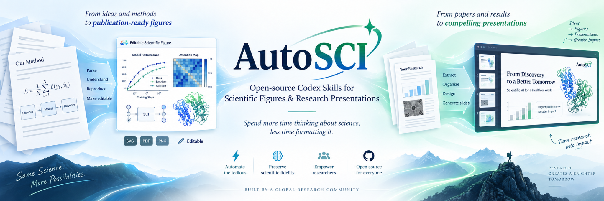

# AutoSCI

<p align="center">
  
</p>

<p align="center"><strong>Spend more time thinking about science, less time formatting it.</strong></p>

<p align="center">
  Open-source, local-first Codex skills for evidence-grounded manuscript writing and review, literature research, experiment goal design and execution, scientific data analysis, scientific figures, paper reading, group meetings, research updates, and technical presentations.
</p>

<p align="center">
  <a href="README_zh.md">中文</a> ·
  <a href="#quick-start">Quick Start</a> ·
  <a href="#skills">Skills</a> ·
  <a href="#under-the-hood">Under the Hood</a> ·
  <a href="skills/scientific-figure/scripts/">Python Tools</a> ·
  <a href="CONTRIBUTING.md">Contributing</a>
</p>

<p align="center">
  
  
  
  
  
  
  
  
  
  
</p>

## What is AutoSCI?

AutoSCI is **not just a collection of prompts**. It packages research workflows as Codex Skills and backs the parts that should be deterministic with real tooling.

```text
research source / paper / method / results
                    │
                    ↓
             Codex Skill workflow
          (SKILL.md + references)
                    │
          ┌─────────┴─────────┐
          ↓                   ↓
 scientific reasoning   deterministic tooling
 & visual decisions      Python / QA / render
          └─────────┬─────────┘
                    ↓
       scientific artifact
   figure / presentation / QA
```

The design principle is simple: **encode scientific judgment as an inspectable workflow, and automate the mechanical parts with deterministic code.**

## Why AutoSCI?

Research time is expensive. Too much of it is still spent on work that is necessary but repetitive: redrawing method diagrams, aligning arrows, rebuilding figures, cropping paper screenshots, arranging slides, checking legends, and repeatedly fixing presentation layouts.

**AutoSCI exists to reduce that mechanical cost.** We want researchers to spend more attention on the scientific question, the method, the experiment, the interpretation, and the next idea — while reusable Codex skills handle more of the tedious production work around scientific communication.

This is not about replacing scientific judgment. It is about removing friction between an idea and a clear scientific artifact.

> **Automate the tedious. Preserve the science. Leave more room for imagination.**

## Skills

AutoSCI currently contains nine complementary, independently installable skills:

| Skill | What it does | Implementation |
| --- | --- | --- |
| [`literature-research`](skills/literature-research) | Searches, screens, deduplicates, resolves report-to-study identity, clusters topics, builds claim-level evidence tables and citation trails, and produces audited study-aware synthesis | Skill workflow + references + templates + **Python normalization, screening, study-identity, provenance, synthesis, schema, snapshot and handoff tooling** |
| [`manuscript-reviewer`](skills/manuscript-reviewer) | Audits claim–evidence alignment, figure/table/text consistency, numerical integrity, notation, citation support, protocol comparability, overclaiming, and revision/rebuttal resolution | Evidence-led reviewer workflow + canonical finding records + schemas + **semantic regression fixtures and release validation** |
| [`academic-manuscript-writing`](skills/academic-manuscript-writing) | Builds, revises, refreshes, and audits scientific manuscripts from supplied evidence, with claim traceability and source-aware writing contracts | Skill workflow + references + templates + schemas + **deterministic preflight, revision lineage, and venue-profile audits** |
| [`scientific-data-analysis`](skills/scientific-data-analysis) | Turns scientific tabular data into an auditable workflow spanning data cleaning, prespecified inference, effect sizes and uncertainty, sensitivity analysis, reproducible plotting, and prospective power/sample-size planning | Skill workflow + references + templates + **deterministic Python cleaning, statistics, plotting, provenance, power-planning, reconciliation and release QA** |
| [`scientific-figure`](skills/scientific-figure) | Creates/reconstructs editable scientific figures from methods, equations, code, data, or existing figures | Skill workflow + references + **Python orchestration, audits, rendering, release and benchmark tooling** |
| [`academic-research-presentation`](skills/academic-research-presentation) | Builds/reviews evidence-first paper-reading, group-meeting, research-update, and technical-talk workflows | Skill workflow + references + templates + source-visual/diagram QA rules |
| [`paper-reproduction`](skills/paper-reproduction) | Reconstructs published research as runnable, claim-scoped experiments with paper↔code traceability, pinned revisions, environment/run provenance, discrepancy analysis, and release handoff | Skill workflow + templates + schemas + **repository inspection, run ledger, provenance binding, claim reconciliation, readiness, and release tooling** |
| [`experiment-goal-design`](skills/experiment-goal-design) | Turns a research claim into literature-aligned, benchmark-comparable goals; requires traceable evidence for numeric gates, records conditions/controls, and drafts an approval-ready protocol | Skill workflow + evidence/threshold references + goal, protocol, and comparability templates |
| [`experiment-execution`](skills/experiment-execution) | Turns an approved protocol into a benchmark-complete, staged-seed campaign with immutable configs, append-only attempts, traceable metrics/checkpoints, and provenance audits | Skill workflow + references + schemas + templates + **deterministic campaign preflight and run-ledger audit tooling** |

They can be used separately or chained together. A literature review can produce an audited evidence workspace for later figure or presentation work:

```text
research question / literature corpus
             │
             ↓
     $literature-research
             ↓
 audited evidence workspace
             │
       ┌─────┴─────┐
       ↓           ↓
$scientific-figure  $academic-research-presentation
```

`scientific-data-analysis` can be used before data collection for auditable power/sample-size planning and after data collection for prespecified analysis, uncertainty, robustness checks, and reproducible figures:

```text
design question / tabular data
          │
          ↓
$scientific-data-analysis
          ↓
power plan / audited analysis
 + effect size / uncertainty / figures
```

The manuscript reviewer can also be used independently on a draft, supplement, references, rebuttal, or revised manuscript:

```text
manuscript / supplement / references / rebuttal
                    │
                    ↓
          $manuscript-reviewer
                    ↓
     evidence-backed findings
  + revision lineage / coverage gaps
```

`academic-manuscript-writing` handles evidence-grounded drafting and revision. Its v2.0 workflow separates scientific evidence from time-sensitive writing guidance: when a discipline or venue profile is requested, it records applicable official sources, normalizes their constraints, and validates the manuscript against a versioned contract. It also supports claim/evidence ledgers, source-conflict disclosure, revision lineage, manuscript coverage, and release preflight.

The figure and presentation skills can also be used directly:

```text
paper / method / results
        │
        ├── need a custom scientific figure?
        │          ↓
        │   $scientific-figure
        │          ↓
        │      editable SVG
        │
        └──────────┬──────────
                   ↓
      $academic-research-presentation
                   ↓
          research presentation
```

## Under the Hood

The repository combines **agent instructions, domain knowledge, structured templates, and executable code** in an inspectable workflow.

### Scientific Figure: executable pipeline

```text
SKILL.md
   ↓
source-grounded figure_spec.json
   ↓
Python orchestration
   ↓
editable SVG master
   ↓
deterministic QA
   ├── source / claim audit
   ├── semantic traceability
   ├── geometry audit
   ├── notation audit
   ├── final-size legibility
   └── portability / release checks
   ↓
render → critique → targeted refinement
   ↓
SVG / PNG / PDF release package
```

Key executable entry points live in [`skills/scientific-figure/scripts/`](skills/scientific-figure/scripts):

```text
doctor.py              environment capability check
orchestrate.py         workflow state / checkpoint orchestration
validate_spec.py       semantic-spec validation
source_audit.py        claim-to-source grounding audit
geometry_audit.py      SVG geometry checks
notation_audit.py      mathematical notation checks
preflight.py           profile-aware deterministic QA
render_svg.py          SVG rendering
render_package.py      inspection/render package
finalize_figure.py     release packaging
benchmark.py           single-case evaluation
benchmark_suite.py     multi-case skill evaluation
```

`scientific-data-analysis` follows the same inspectable-workflow principle for quantitative research: analysis and power plans are explicit contracts, deterministic scripts execute cleaning/statistics/plots, and preflight reconciliation re-computes planned results to catch stale or tampered artifacts. The release gate lives at [`skills/scientific-data-analysis/scripts/release_check.py`](skills/scientific-data-analysis/scripts/release_check.py).

The presentation skill is intentionally more reasoning-oriented: its implementation is the explicit research workflow in `SKILL.md`, source-visual and diagram safety rules in `references/`, and reusable evidence/storyboard/preflight structures in `templates/`.

## What we automate — and what we do not

**Good candidates for automation:** declared data-cleaning rules, deterministic statistical calculations and reconciliation, repetitive figure construction, layout/alignment/routing, figure/table extraction checks, slide organization, deterministic notation/geometry/clipping/readability checks, and repeated render-inspect-refine cycles.

**Still belongs to the researcher:** choosing the problem, assumptions and methodology; validating experiments and evidence; interpreting results; deciding which claims are justified; and making the final communication choices.

The goal is simple: **reduce the mechanical work around research without reducing the researcher’s agency.**

## Literature Research — v1.6.1

`literature-research` is an evidence-first workflow for literature discovery, screening, deduplication, report-to-study identity, topic organization, claim-level evidence extraction, citation trails, and study-aware synthesis.

It separates research judgment from mechanical QA: the model designs searches and interprets evidence, while deterministic Python tooling handles normalization, conservative deduplication, screening reconciliation, study identity audits, search/stopping-rule audits, synthesis provenance, workspace schemas, frozen snapshots, and downstream handoff packages.

The skill supports `exploratory`, `standard`, and `systematic` profiles. It explicitly distinguishes attempted versus successful search coverage, `full_text_attempted` versus genuinely `full_text_screened`, report counts versus independent-study counts, and scientific evidence state versus verification coverage. It does not turn a standard evidence review into a claimed systematic review when retrieval coverage is incomplete.

See [`SKILL.md`](skills/literature-research/SKILL.md), [`references/`](skills/literature-research/references/), [`templates/`](skills/literature-research/templates/), and the executable [`scripts/`](skills/literature-research/scripts/) directory.

## Manuscript Reviewer — v1.1.0

`manuscript-reviewer` is an evidence-first scientific argument auditor for pre-submission checks and revision/rebuttal review. It asks a narrower question than a generic reviewer: **does the manuscript say exactly what its available evidence supports?**

It decomposes central claims into atomic propositions, traces them to experiments, figures, tables, formulas and citations, checks numerical and notation consistency, verifies protocol/provenance comparability before comparing results, distinguishes findings from author queries and coverage gaps, and tracks whether revision changes actually resolve prior scientific roots.

The skill uses canonical finding records so the executive summary, main comments and revision report inherit the same disposition, severity and evidence boundary. It also includes semantic regression fixtures derived from blind stress testing, including false-positive resistance, revision severity recalibration and prompt-injection resistance for untrusted manuscript content.

It is **not** an accept/reject predictor and does not replace scientific judgment. Its role is manuscript integrity and evidence alignment.

See [`SKILL.md`](skills/manuscript-reviewer/SKILL.md), [`checks/`](skills/manuscript-reviewer/checks/), [`schemas/`](skills/manuscript-reviewer/schemas/), [`regressions/`](skills/manuscript-reviewer/regressions/), and [`docs/EVALUATION.md`](skills/manuscript-reviewer/docs/EVALUATION.md).

## Academic Manuscript Writing — v2.0.0

`academic-manuscript-writing` supports building, revising, refreshing, and auditing scientific manuscripts from results, figures, tables, methods, and research notes. It keeps a traceable chain from sources and evidence to claims, section/reporting contracts, manuscript text, revision obligations, and release checks.

For discipline- or venue-specific work, v2.0 resolves a writing profile from retrieved, applicable guidance and links its requirements to a `manuscript_contract.json`. Writing requirements remain separate from scientific evidence, and venue readiness is reported only after the contract and release checks are verified.

See [`SKILL.md`](skills/academic-manuscript-writing/SKILL.md), [`references/`](skills/academic-manuscript-writing/references/), [`templates/`](skills/academic-manuscript-writing/templates/), [`schemas/`](skills/academic-manuscript-writing/schemas/), and [`scripts/`](skills/academic-manuscript-writing/scripts/). Run its packaged checks with `python skills/academic-manuscript-writing/scripts/self_test.py --quick`.

## Scientific Data Analysis — v1.6.1

`scientific-data-analysis` is an audit-first workflow for scientific tabular data. It locks the scientific question, estimand, independent analysis unit, variable roles, exclusions and analysis family before inference; records cleaning decisions and their rationale; reports effect magnitude and uncertainty alongside significance tests; supports declared sensitivity analyses and multiplicity correction; and produces reproducible plots whose cohorts are reconciled against the statistical results.

It also has a separate **pre-data planning** branch for prospective power/sample-size work. Current planning families cover two-group Welch means, paired means, independent proportions, and prespecified heteroscedastic Welch contrasts, with explicit assumption provenance, scenario analysis, approximation-adequacy checks, and deterministic power-result reconciliation. It deliberately does not use observed/post-hoc power as evidence after a completed study.

The current release includes schema-validated examples/templates, `doctor.py`, two self-test suites, deterministic preflights for both analysis and power artifacts, and `release_check.py` for repository/release gating.

See [`SKILL.md`](skills/scientific-data-analysis/SKILL.md), [`references/`](skills/scientific-data-analysis/references/), [`templates/`](skills/scientific-data-analysis/templates/), [`examples/`](skills/scientific-data-analysis/examples/), and the executable [`scripts/`](skills/scientific-data-analysis/scripts/) directory.

## Scientific Figure — v2.0 Stable

`scientific-figure` is a structure-first workflow for creating and reconstructing editable research figures. It combines a source-grounded semantic contract with traceable SVG and deterministic Python QA.

Highlights include semantic locking, Spec ↔ SVG traceability, anti-"box soup" visual grammar, geometry/notation/legibility/portability audits, `draft` / `standard` / `release` profiles, checkpoint/resume orchestration, release packaging, and an optional blind benchmark harness.

For quantitative experimental plots, the skill prefers authoritative data + plotting code over visually invented curves.

See [`SKILL.md`](skills/scientific-figure/SKILL.md), [`STABILITY.md`](skills/scientific-figure/STABILITY.md), and the executable [`scripts/`](skills/scientific-figure/scripts/) directory.

## Academic Research Presentation — V3

`academic-research-presentation` is designed for research decks where scientific evidence and information density matter more than generic presentation aesthetics.

Its priority order is scientific fidelity → source visual integrity → figures/tables/equations → technical mechanism → narrative and visual polish.

V3 addresses two recurring automated-slide failures: custom flowcharts with invented or reversed directions, and paper-figure screenshots that are incomplete or contaminated. It emphasizes evidence-first slides, complete source visuals, one hero scientific visual per slide by default, canvas-first composition, and render checks against the source layout.

This skill guides presentation reasoning and quality checks. Pair it with the slide-generation toolchain available in your Codex environment.

See [`SKILL.md`](skills/academic-research-presentation/SKILL.md), [`references/`](skills/academic-research-presentation/references/), and [`templates/`](skills/academic-research-presentation/templates/).

## Paper Reproduction — v1.2.0

`paper-reproduction` turns a paper's published claims into a claim-scoped, auditable experiment workflow. It resolves paper/repository identity and revision, maps claims to code/config/data/checkpoints, records environment and run provenance, distinguishes blockers from discrepancies, and produces a reproducible handoff.

The v1.2.0 release closes provenance and reconciliation gaps: target-run provenance fails closed if a required snapshot is incomplete or an execution-defining manifest disappears; metric rows must match the metric declared by their claim before they can support reconciliation; and repository commands run with a filtered environment unless additional non-secret variables are explicitly selected.

See [`SKILL.md`](skills/paper-reproduction/SKILL.md), [`references/`](skills/paper-reproduction/references/), [`templates/`](skills/paper-reproduction/templates/), and the executable [`scripts/`](skills/paper-reproduction/scripts/) directory. Run its regression suite with `python -m unittest discover -s skills/paper-reproduction/tests -v`.

## Experiment Goal Design v4.0.0

`experiment-goal-design` is the upstream planning step for a proposed research claim. It compares field-defining and directly relevant studies with official benchmark protocols across dataset/version/scope, split, loader, metric, baselines, controlled variables, analysis, and compute context. A named benchmark must always use its complete official scope; a hand-picked subset cannot support a narrower claim. A numeric success or stop threshold is allowed only with applicable evidence or an explicit derivation and precise locator; unsupported gates are removed in favor of an estimation/comparison goal or recorded as unresolved. One run/seed per condition is the default; late seed search for score optimization is optional and must be disclosed. Version 4.0.0 records conditions and protocol source locators, creates an owner-reviewable protocol draft, and maps only compatible goal groups to execution campaigns after approval.

See [`SKILL.md`](skills/experiment-goal-design/SKILL.md), [`references/evidence-and-thresholds.md`](skills/experiment-goal-design/references/evidence-and-thresholds.md), and [`templates/`](skills/experiment-goal-design/templates/). Download the [current complete v4.0.0 package](releases/experiment-goal-design-v4.0.0.zip) and its [SHA-256 file](releases/experiment-goal-design-v4.0.0.zip.sha256). The current repository tree keeps only the latest complete package; earlier ZIP archives are omitted. Review the [three-round independent audit log](releases/experiment-goal-design-audit-log.md).

## Experiment Execution v1.12.0

`experiment-execution` enforces full official benchmark scope and makes one seed sufficient by default; repeats are optional when the official protocol or a statistical claim needs them. A late seed search for a higher score is an optional optimization step. Report all tried runs and identify the selected score as selection-conditioned; it does not establish an unbiased or robust estimate. Register every numeric goal or decision gate with its source, locator, applicability, and derivation. When a threshold lacks support, leave the decision unresolved until its basis is established. The skill freezes protocol/config/source identity, records attempt-specific artifacts, and audits provenance. Companion skills remain optional.

See [`SKILL.md`](skills/experiment-execution/SKILL.md), [`references/`](skills/experiment-execution/references/), [`schemas/`](skills/experiment-execution/schemas/), [`templates/`](skills/experiment-execution/templates/), and [`scripts/`](skills/experiment-execution/scripts/). Download the [complete v1.12.0 package](releases/experiment-execution-v1.12.0.zip) and its [SHA-256 file](releases/experiment-execution-v1.12.0.zip.sha256).

## Quick Start

```bash
git clone https://github.com/Ethan-ai637/AutoSCI.git
cd AutoSCI

mkdir -p "${CODEX_HOME:-$HOME/.codex}/skills"
cp -R skills/literature-research "${CODEX_HOME:-$HOME/.codex}/skills/"
cp -R skills/manuscript-reviewer "${CODEX_HOME:-$HOME/.codex}/skills/"
cp -R skills/academic-manuscript-writing "${CODEX_HOME:-$HOME/.codex}/skills/"
cp -R skills/scientific-data-analysis "${CODEX_HOME:-$HOME/.codex}/skills/"
cp -R skills/scientific-figure "${CODEX_HOME:-$HOME/.codex}/skills/"
cp -R skills/academic-research-presentation "${CODEX_HOME:-$HOME/.codex}/skills/"
cp -R skills/paper-reproduction "${CODEX_HOME:-$HOME/.codex}/skills/"
cp -R skills/experiment-goal-design "${CODEX_HOME:-$HOME/.codex}/skills/"
cp -R skills/experiment-execution "${CODEX_HOME:-$HOME/.codex}/skills/"
```

Reload Codex and invoke a skill explicitly:

```text
Use $literature-research to review 2022–2026 empirical studies on LLM clinical decision support.
Use standard mode, preserve the search/screening trail, distinguish reports from underlying studies, and deliver an audited evidence table + synthesis.
```

```text
Use $manuscript-reviewer to audit paper.pdf before submission.
Check claim–evidence alignment, figure/table/text consistency, numerical integrity, notation, citations, protocol comparability, and overclaiming.
```

```text
Use $academic-manuscript-writing to revise my manuscript from the verified results and figures.
Preserve supported text, trace every substantive claim to evidence, record unresolved source conflicts, and run the appropriate preflight.
```

```text
Use $scientific-data-analysis to analyze experiment.csv with an audit-first workflow.
Lock the independent unit and analysis plan before inference; report effect sizes + confidence intervals, run declared sensitivity analyses, generate reproducible plots, and preserve deterministic preflight/provenance artifacts.
```

```text
Use $scientific-figure to turn the Method section of paper.pdf into an editable Figure 1.
Use standard mode, preserve mathematical notation, and deliver SVG + target-size PNG.
```

```text
Use $academic-research-presentation to build a 15-slide paper-reading presentation from paper.pdf.
Use the paper's main figures and tables as the focus, and explain the evidence on each slide.
```

```text
Use $paper-reproduction in REPO_REPRODUCE mode for Table 2 of this paper.
Pin the paper-era repository revision, map the claim to code/config/data, run a smoke test first, and preserve target-run provenance and discrepancies.
```

```text
Use $experiment-execution to preflight and audit my benchmark campaign.
Keep the complete official benchmark scope, use one seed for the pilot, preserve attempt-specific raw evidence, and do not mark incomplete runs as benchmark results.
```

For Scientific Data Analysis and Scientific Figure, you can inspect local capabilities with:

```bash
python skills/scientific-data-analysis/scripts/doctor.py
python skills/scientific-data-analysis/scripts/release_check.py
python skills/scientific-figure/scripts/doctor.py
```

## Repository Layout

```text
AutoSCI/
├── assets/readme/                      # README artwork
├── skills/
│   ├── literature-research/
│   │   ├── SKILL.md                    # Codex skill entry point
│   │   ├── references/                 # search/screening/evidence/study-identity guidance
│   │   ├── schemas/                    # versioned workspace contracts
│   │   ├── templates/                  # protocol/search/screening/evidence templates
│   │   └── scripts/                    # deterministic review/audit/handoff tooling
│   ├── manuscript-reviewer/
│   │   ├── SKILL.md                    # evidence-led manuscript audit entry point
│   │   ├── checks/                     # claim/evidence, consistency, citation, notation, revision rules
│   │   ├── schemas/                    # canonical finding and revision-delta contracts
│   │   ├── regressions/                # semantic regression fixtures
│   │   └── scripts/                    # release/build validation
│   ├── academic-manuscript-writing/
│   │   ├── SKILL.md                    # evidence-grounded manuscript workflow
│   │   ├── references/                 # source, claim, revision, and writing-profile guidance
│   │   ├── schemas/                    # project, writing-profile, and manuscript contracts
│   │   ├── templates/                  # evidence, claim, reporting, and writing-workspace templates
│   │   └── scripts/                    # deterministic audits, preflight, and self-tests
│   ├── scientific-data-analysis/
│   │   ├── SKILL.md                    # audit-first analysis/planning entry point
│   │   ├── references/                 # cleaning/statistics/uncertainty/power guidance
│   │   ├── templates/                  # analysis-plan, data-dictionary and power-plan templates
│   │   ├── examples/                   # executable toy plans/data
│   │   └── scripts/                    # deterministic analysis, plotting, power and QA tooling
│   ├── scientific-figure/
│   │   ├── SKILL.md                    # Codex skill entry point
│   │   ├── agents/                     # agent metadata
│   │   ├── assets/                     # structured templates
│   │   ├── references/                 # workflow/domain knowledge
│   │   └── scripts/                    # executable Python tooling
│   ├── academic-research-presentation/
│       ├── SKILL.md                    # Codex skill entry point
│       ├── references/                 # scientific presentation rules
│       ├── templates/                  # evidence/storyboard/QA templates
│       └── examples/                   # anti-pattern examples
│   ├── experiment-goal-design/
│   │   ├── SKILL.md                    # claim-to-goal workflow with source-grounded thresholds
│   │   ├── references/                 # comparability and numeric decision evidence
│   │   └── templates/                  # goal contract, comparability matrix, design note
│   └── experiment-execution/
│       ├── SKILL.md                    # benchmark-complete campaign workflow
│       ├── references/                 # benchmark, seed, ledger, and migration rules
│       ├── schemas/                    # campaign, attempt, metric, environment contracts
│       ├── templates/                  # campaign and attempt artifact templates
│       └── scripts/                    # campaign preflight and provenance audit
├── README.md
├── README_zh.md
└── LICENSE
```

Each skill is self-contained and can be copied into a local Codex skills directory independently.

## Design Principles

- **Scientific fidelity before aesthetics.**
- **Evidence before decorative diagrams.**
- **Structure before coordinates.**
- **Editable source artifacts before flattened screenshots.**
- **Deterministic code for deterministic failure modes.**
- **Render, inspect, and refine every deliverable with a visual preview.**
- **Add workflow complexity only when a reproducible failure justifies it.**

## Project Status

- **Literature Research:** `v1.6.1`, real-world-tested standard-workflow baseline with search/screening/study/synthesis provenance and reproducible handoff.
- **Manuscript Reviewer:** `v1.1.0`, evidence-led pre-submission and revision/rebuttal audit baseline with canonical findings and regression-driven validation.
- **Academic Manuscript Writing:** `v2.0.0`, evidence-traceable manuscript build/revision with dynamic writing profiles, manuscript contracts, revision lineage, and deterministic release QA.
- **Paper Reproduction:** `v1.2.0`, claim-scoped reproduction workflow with fail-closed execution provenance, metric-to-claim reconciliation, and filtered command environments.
- **Scientific Data Analysis:** `v1.6.1`, audit-first tabular analysis + prospective power/sample-size planning with deterministic reconciliation and release gating.
- **Scientific Figure:** `v2.0.0`, stable production contract.
- **Academic Research Presentation:** `v3.0.0`, focused on evidence-first presentation design, diagram safety, and complete acquisition of paper figures/tables.
- **Experiment Execution:** `v1.12.0`, benchmark-complete campaign preflight and attempt-level provenance audit with staged seed use.
- **Experiment Goal Design:** `v4.0.0`, full-official-scope benchmark goals, source-grounded thresholds, condition matrices, approved protocol drafts, and compatible campaign handoff.

## Acknowledgements

The Scientific Figure skill is an independent workflow implementation. Its iterative **generate → render → evaluate → refine** philosophy was influenced in part by public work on scientific-figure agents such as [ResearAI/AutoFigure](https://github.com/ResearAI/AutoFigure) and [AutoFigure-Edit](https://github.com/ResearAI/AutoFigure-Edit). AutoSCI does not bundle their code, model weights, hosted services, or API credentials and is not affiliated with those projects.

The Academic Research Presentation skill documents its public design references in [`references/08-sources-and-rationale.md`](skills/academic-research-presentation/references/08-sources-and-rationale.md).

AutoSCI is an independent community project and is not an official OpenAI project.

## Contributing

Issues and pull requests are welcome. Please read [`CONTRIBUTING.md`](CONTRIBUTING.md).

> **A new rule should correspond to a concrete, reproducible failure mode.**

## License

MIT License. See [`LICENSE`](LICENSE).
